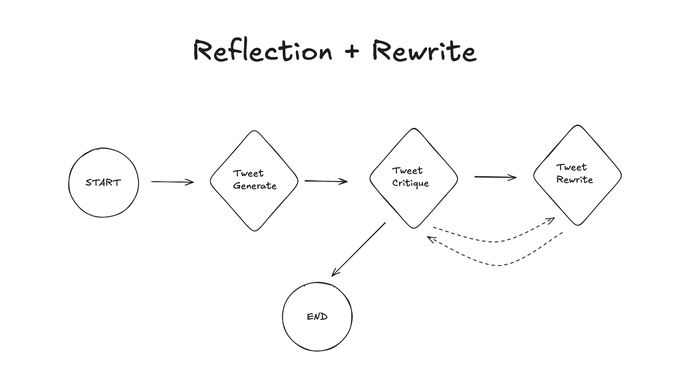

# 🤖 Tweet AI Agent

Enterprise-grade AI system for intelligent tweet generation with automated critique and iterative improvement.

[](https://www.python.org/downloads/)
[](https://github.com/langchain-ai/langgraph)
[](https://openai.com/)
[](https://github.com)

## ✨ Features

### 🚀 **Core Capabilities**
- **Intelligent Tweet Generation**: AI-powered content creation with quality scoring
- **Automated Critique System**: Self-evaluating AI that scores and improves content
- **Iterative Improvement**: Automatic rewriting until quality threshold is met
- **Multi-language Support**: Russian and English prompts with easy switching

### 🏗️ **Enterprise Architecture**
- **Modular Design**: 10 specialized modules with single responsibility
- **Error Resilience**: Comprehensive retry logic with exponential backoff
- **Provider Abstraction**: Seamless model switching without code changes
- **Intelligent Caching**: TTL-based caching with LRU eviction and persistence

### 🔒 **Security & Reliability**
- **Input Sanitization**: XSS and injection attack protection
- **Fallback Mechanisms**: High availability with backup providers
- **Correlation Tracking**: Full request traceability for debugging
- **Performance Monitoring**: Real-time metrics and observability

### ⚙️ **Management Tools**
- **Model Switcher**: Live model configuration and performance testing
- **Cache Manager**: Intelligent cache optimization and monitoring
- **Admin Utilities**: Command-line tools for system management

## 🚀 Quick Start

### Prerequisites
- Python 3.13+
- OpenAI API key

### Installation

1. **Clone the repository**
   ```bash
   git clone <repository-url>
   cd ai-tweet-reflection-agent
   ```

2. **Install dependencies**
   ```bash
   pip install -r requirements.txt
   # or with uv
   uv install
   uv sync
   ```

3. **Set up environment**
   ```bash
   echo "OPENAI_API_KEY=your_key_here" > .env
   ```

4. **Run the system**
   ```bash
   python main.py
   ```

### First Tweet Generation

The system will automatically:
1. 🤖 Generate a tweet about the specified topic
2. 📊 Evaluate quality (0.0-1.0 scale)
3. ✏️ Rewrite if quality is below threshold (0.78)
4. 📈 Output final result with metrics

Example output:
```
========== FINAL ==========
AI revolutionizes development, accelerating processes and improving code quality. 
It helps automate routine tasks, allowing developers to focus on creative solutions. 
#AI #Development #Innovation
============================================================
reason: accepted | best_score: 0.90
```

## 📚 Documentation

- **[📖 HELPER_EN.md](HELPER_EN.md)** - Complete English usage guide  

## 🔧 Management Tools

### Model Management
```bash
# View all model status
python model_switcher.py status

# Switch to GPT-4o for higher quality
python model_switcher.py switch generation gpt-4o --temperature 0.6

# Compare model performance
python model_switcher.py compare gpt-4o-mini gpt-4o --message "AI innovations"

# Add fallback providers
python model_switcher.py fallback generation gpt-3.5-turbo
```

### Cache Management
```bash
# View cache statistics
python cache_manager.py stats

# Test cache performance
python cache_manager.py test

# Configure cache settings
python cache_manager.py config --max-size 2000 --ttl 7200
```

## ⚙️ Configuration

### Environment Variables (.env)
```bash
# Required
OPENAI_API_KEY=your_key_here

# Optional customization
MODEL_NAME=gpt-4o-mini
TEMPERATURE=0.4
QUALITY_SCORE_THRESHOLD=0.78
MAX_RETRIES=3
REQUEST_TIMEOUT=120
```

### Programmatic Configuration
```python
from config import TweetAgentConfig

# Custom configuration
config = TweetAgentConfig(
    model_name="gpt-4o",
    temperature=0.6,
    quality_threshold=0.85,
    max_retries=5
)
```

## 🏗️ Architecture

### System Overview



**Workflow Logic:**
- **START** → **Tweet Generate** → **Tweet Critique**
- **Conditional Router**: Based on quality score and iteration limit
  - ✅ **Quality met OR max iterations** → **END**
  - 🔄 **Needs improvement** → **Tweet Rewrite** → back to **Critique**


### Core Components

| Component | Purpose | Technology |
|-----------|---------|------------|
| **LangGraph Workflow** | Orchestration engine | StateGraph with conditional routing |
| **LLM Provider** | Model abstraction layer | OpenAI GPT-4o/mini with fallbacks |
| **Monitoring System** | Observability & metrics | Correlation IDs, performance tracking |
| **Caching Layer** | Performance optimization | TTL-based with LRU eviction |
| **Security Layer** | Input validation | XSS/injection protection |

### Modular Structure
```
├── main.py                    # 🚀 Workflow orchestrator (83 lines)
├── config.py                  # ⚙️ Configuration management
├── models.py                  # 📋 Pydantic data models
├── model_switcher.py          # 🔄 Model management utility
├── cache_manager.py           # 💾 Cache management utility
└── agents/                    # 🤖 Core AI agents
    ├── generation.py          #     Tweet generation
    ├── critique.py            #     Quality evaluation
    ├── rewrite.py             #     Content improvement
    ├── llm_provider.py        #     Model abstraction
    ├── monitoring.py          #     Performance tracking
    ├── cache.py               #     Intelligent caching
    └── input_sanitizer.py     #     Security validation
```

## 📊 Performance Metrics

### Code Quality Improvements
- **10 specialized modules** vs monolithic architecture
- **Complete error handling** with retry logic and fallbacks
- **Full observability** with correlation tracking

### Production Features
- ✅ **Enterprise-grade error handling**
- ✅ **Comprehensive monitoring and metrics**
- ✅ **Security-hardened input validation**
- ✅ **High availability with fallback providers**
- ✅ **Performance optimization with intelligent caching**
- ✅ **Live configuration without restarts**

## 💻 Usage Examples

### Basic Tweet Generation
```python
from main import graph
from config import DEFAULT_INITIAL_STATE
from langchain_core.messages import HumanMessage

# Generate tweet about custom topic
state = {
    "messages": [HumanMessage(content="Future of renewable energy")],
    "language": "en",
    **DEFAULT_INITIAL_STATE
}

result = graph.invoke(state)
print(f"Generated tweet: {get_final_tweet(result)}")
```

### Batch Processing
```python
topics = [
    "AI in healthcare",
    "Sustainable technology", 
    "Future of work"
]

for topic in topics:
    state = {
        "messages": [HumanMessage(content=topic)],
        **DEFAULT_INITIAL_STATE
    }
    result = graph.invoke(state)
    print(f"Topic: {topic}")
    print(f"Tweet: {get_final_tweet(result)}")
```

### Custom Quality Thresholds
```python
# High-quality tweets (more iterations)
high_quality_state = {
    "messages": [HumanMessage(content="Machine learning breakthroughs")],
    "quality_threshold": 0.9,
    "max_iters": 5,
    **DEFAULT_INITIAL_STATE
}

result = graph.invoke(high_quality_state)
```

## 🚨 Troubleshooting

### Common Issues

| Problem | Solution |
|---------|----------|
| **API Key Error** | Check `.env` file and verify OpenAI key |
| **Slow Performance** | Increase cache size: `python cache_manager.py config --max-size 2000` |
| **Low Quality Results** | Switch to better model: `python model_switcher.py switch generation gpt-4o` |
| **Validation Errors** | Check input for HTML/scripts, use sanitized topics |

### Diagnostics
```bash
# Check system status
python model_switcher.py status

# View cache performance
python cache_manager.py stats

# Test individual components
python model_switcher.py test generation --message "test"
```

## 🤝 Contributing

1. Fork the repository
2. Create a feature branch (`git checkout -b feature/amazing-feature`)
3. Commit changes (`git commit -m 'Add amazing feature'`)
4. Push to branch (`git push origin feature/amazing-feature`)
5. Open a Pull Request

### Development Setup
```bash
# Install development dependencies
pip install -r requirements-dev.txt

# Run tests
pytest

# Code formatting
black .
isort .
```

## 📄 License

This project is licensed under the MIT License - see the [LICENSE](LICENSE) file for details.

## 🙏 Acknowledgments

- **[LangGraph](https://github.com/langchain-ai/langgraph)** - Workflow orchestration framework
- **[OpenAI](https://openai.com/)** - GPT models for content generation
- **[Pydantic](https://pydantic.dev/)** - Data validation and settings management

## 🆘 Support

- 📚 **Documentation**: [HELPER.md](HELPER.md) for Russian guide, [HELPER_EN.md](HELPER_EN.md) for English
- 🐛 **Issues**: Report bugs via GitHub Issues
- 💬 **Discussions**: GitHub Discussions for questions and ideas

---

<div align="center">

**⭐ Star this repo if you find it useful! ⭐**

Made with ❤️ for the AI community

</div>
